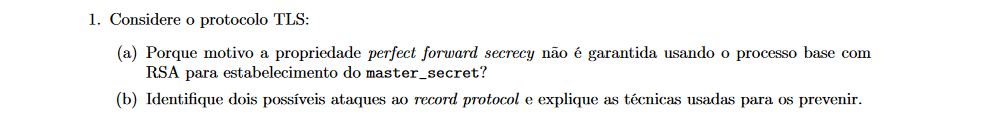
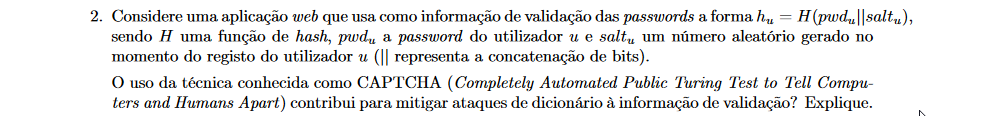
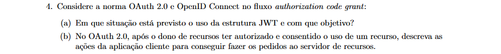
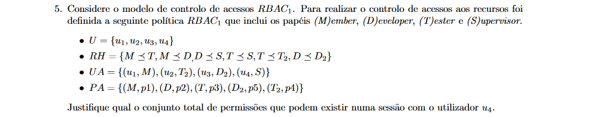
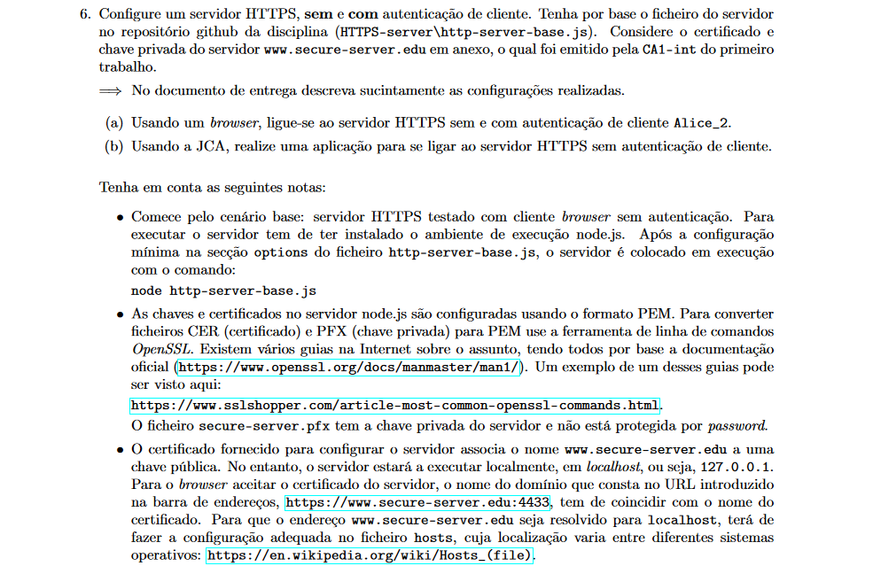
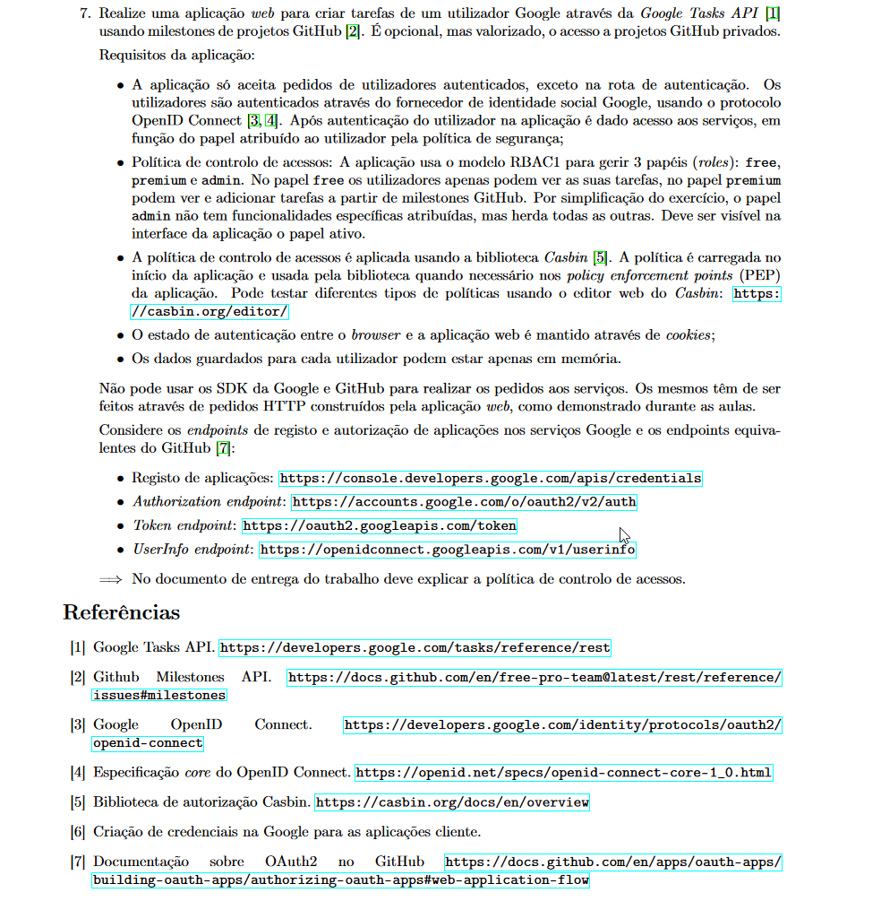

<h2 align="center">Relatório Técnico Segurança Informática</h2>

<p align="center"></p>

<h3 align="center">Grupo 10 </h3>

<div style="margin-left: auto;
            margin-right: auto;
            width: 30%">

| Nome  | n.º Aluno |
| -------: | :------ |
| Tiago Duarte  | 42525  |
| David Abreu  | 43316  |
| Mário Friande  | 43785  |

</div>


<div style="page-break-after: always"></div>

[//]: <> (comments)
[//]: <> (@import "SegInf_inv2324_trab2.pdf")
<hr>

##### Parte 1
<p align="center" style="border: 1px solid #333;"></p>

(a) No RSA se a chave privada for comprometida, acontece que o pre master secret dos handshakes seguintes e dos anteriores (guardados pelo atacante) podem ser decifrados.
Ao contrario se a propriedade perfect forward secrecy for preservada garante que se chave privada for comprometida nao é possivel ao atacante decifrar master secret anteriores e consequentemente não é possivel decifrar mensagens do record protocol.<br/>

(b) Dois possiveis ataques são o ataque de repetição e o ataque de reflexão. 
No caso do ataque de repetição no TLS, este ataque é coibido porque a tag de autenticação da mensagem é computada sobre o seu número de sequência original. Em segurança informática, um nonce é um número arbitrário (muitas vezes aleatório) utilizado uma única vez (nonce vem da junção das palavras number e once). No TLS, o nonce - e, portanto, o número de sequência - é utilizado como parte da mensagem para fins de cálculo da tag de autenticação. Por exemplo se o atacante capturar uma mensagem e tentar reenvia-la quando o receptor fazer a confirmacao da tag vai necessariamente perceber que a mensagem falha na autenticidade.

No caso do ataque de reflexão, a solução do TLS para este problema é o uso de material criptográfico diferente para cada sentido da comunicação. Como discutimos na secção anterior, as chaves e IV utilizados no sentido de A para B são diferentes daqueles usados no sentido de B para A.<br/>

<p align="center" style="border: 1px solid #333;"></p>


Os CAPTCHAs são desafios que visam distinguir humanos de bots ou programas automatizados. Geralmente, esses desafios envolvem a identificação de letras distorcidas, seleção de imagens específicas, resolução de quebra-cabeças ou completar tarefas simples que são fáceis para humanos, mas desafiadoras para programas automatizados. Os CAPTCHAS saofáceis para humanos e dificeis para computadores.

<div style="page-break-after: always"></div>

<p align="center" style="border: 1px solid #333;"></p>

Para garantir a integridade do JWT armazenado em um cookie e detectar se seu conteúdo foi adulterado no navegador, pode-se utilizar uma técnica de assinatura digital. O JWT possui três partes: o cabeçalho (header), o payload (corpo) e a assinatura. A assinatura é gerada usando uma chave secreta conhecida apenas pelo servidor. Essa assinatura é aplicada sobre o cabeçalho codificado em Base64, o payload codificado em Base64 e a chave secreta. Quando o JWT é enviado de volta ao servidor no cookie, o servidor pode recalcular a assinatura usando a chave secreta conhecida e comparar essa assinatura com a presente no JWT recebido. Se as assinaturas não coincidirem, isso indica que o conteúdo do JWT foi alterado.

<p align="center" style="border: 1px solid #333;"></p>

(a) Em resumo, os JWTs são usados no fluxo Authorization Code Grant do OAuth 2.0 e do OpenID Connect para fornecer tokens de acesso e identificação estruturados, compactos e seguros, permitindo a troca de informações entre os diferentes componentes do sistema de maneira confiável.
 
(b) A primeira ação que a aplicação cliente realiza é enviar uma requisição GET para o servidor de autorização, especificando um escopo determinado. Em seguida, o servidor de autorização redireciona para um URL específico de retorno (Authorization Grant). A aplicação cliente então envia uma requisição POST para um endpoint de token no servidor de autorização, requisitando um Access Token. Com o Access Token recebido, a aplicação cliente pode solicitar recursos ao servidor de autorização, incluindo o Access Token válido para acessar os dados desejados.


<p align="center" style="border: 1px solid #333;"></p>

<p align="center"></p>

desenvolver resposta 5


<div style="page-break-after: always"></div>

<p align="center" style="border: 1px solid #333;"></p>


```console

openssl x509 -inform der -in secure-server.cer -out secure-server.pem
openssl pkcs12 -in secure-server.pfx -out private-key.pem -nodes

openssl x509 -inform der -in certificates-keys/end-entities/Alice_2.cer -out Alice_2.pem
openssl x509 -inform der -in certificates-keys/intermediates/CA1-int.cer -out CA1-int.pem

cat Alice_2.pem CA1-int.pem > certificate-chain.pem
```

<div style="page-break-after: always"></div>

<p align="center" style="border: 1px solid #333;"></p>


##### npm packages
    npm install -g nodemon
    npm install cookie-parser body-parser express express-handlebars axios path form-data jsonwebtoken cookie-session config casbin 
    npm install --save-dev crypto


##### usefull links:

    https://github.com/mfriande/repo-viewer
    https://developers.google.com/tasks/reference/rest/v1/tasks/insert?hl=pt-br
    https://developers.google.com/oauthplayground/?code=4/0AfJohXm9vy13qEUQOK6K0a11XLSdb_N9INwXdBl2XYtEbvlO2vyFnDOgk9hKQQmR34y_Eg&scope=https://www.googleapis.com/auth/tasks 


